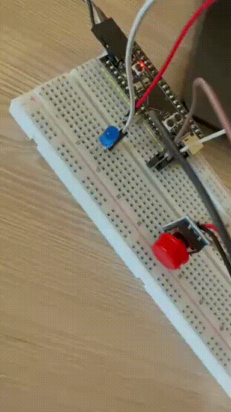

# 🔘 STM32 Embedded C++: Non-Blocking LED & EXTI Button Control

## English Version

A foundational Embedded C++ project for STM32 microcontrollers. This project transitions demonstrating non-blocking timing, hardware interrupts (EXTI), and strict memory management without using the STL or dynamic memory.

### 📷 Demo & Results

**Application Modes:**
1. **Blink**: LED toggles continuously based on a predefined interval without blocking the CPU.
2. **Always On**: LED remains solid.
3. **Always Off**: LED is completely turned off.

### 🛠 Hardware & Wiring

| Component | Quantity | Connection | Note |
| :--- | :--- | :--- | :--- |
| STM32 Board | 1 | - | - |
| LED | 1 | `PA5` | external with a 220Ω resistor to GND. |
| Button Module | 1 | `PA4` (EXTI4) | External 3-pin module. VCC to 3.3V, GND to GND, OUT to PA4. MCU Pull-up enabled. |

### 📊 Implementation & Concepts

*   **Embedded C++ Architecture:** Utilizes `enum class` for strict type safety regarding LED states and application modes. Hardware abstraction is achieved through a custom `Led` class with a `constexpr` constructor, ensuring zero runtime overhead for peripheral initialization.
*   **Memory Safety & Configuration:** Complete elimination of "magic numbers" and global variables (except for the ISR flag). Configuration parameters are stored in a zero-RAM `struct` using `static constexpr`. Dynamic memory allocation (`new`/`malloc`) is strictly avoided.
*   **Non-Blocking Superloop:** Replaces standard `HAL_Delay()` (equivalent to Arduino's `delay()`) with asynchronous time-tracking using `HAL_GetTick()`. This allows the main CPU to evaluate logic and process debouncing simultaneously without stalling.
*   **Hardware Interrupts & Debounce:** The physical button triggers a hardware interrupt on the EXTI line. The ISR is kept minimal—only setting a `volatile bool` flag. The actual state-machine transition and software debouncing (200ms) are handled safely inside the main superloop.

---

## 🇺🇦 Українська версія

Базовий проєкт на Embedded C++ для мікроконтролерів STM32. Цей проєкт демонструє розробку з використанням неблокуючих затримок, апаратних переривань та суворого управління пам'яттю без використання STL або динамічної пам'яті.

### 📷 Демонстрація та результати

**Режими роботи:**
1. **Blink**: Світлодіод блимає із заданим інтервалом без блокування процесора.
2. **Always On**: Світлодіод постійно світиться.
3. **Always Off**: Світлодіод повністю вимкнений.

### 🛠 Компоненти та підключення

| Компонент | Кількість | Підключення | Примітка |
| :--- | :--- | :--- | :--- |
| Плата STM32 | 1 | - | - |
| Світлодіод | 1 | `PA5` | зовнішній з резистором 220 Ом на GND. |
| Модуль кнопки | 1 | `PA4` (EXTI4) | Зовнішній 3-піновий модуль. VCC до 3.3V, GND до GND, OUT до PA4. Увімкнено Pull-up. |

### 📊 Реалізація та концепції

*   **Архітектура Embedded C++:** Використання `enum class` для суворої типізації станів світлодіода та режимів роботи. Апаратна абстракція реалізована через власний клас `Led` з конструктором `constexpr`, що забезпечує нульові витрати продуктивності під час ініціалізації.
*   **Безпека пам'яті та налаштування:** Повна відмова від «магічних чисел» та глобальних змінних (окрім прапорця переривання). Параметри конфігурації зберігаються у структурі через `static constexpr`, що не займає оперативної пам'яті (RAM). Динамічне виділення пам'яті (`new`/`malloc`) категорично не використовується.
*   **Неблокуючий Superloop:** Стандартний `HAL_Delay()` (аналог `delay()` в Arduino) замінено на асинхронне відстеження часу за допомогою `HAL_GetTick()`. Це дозволяє процесору одночасно обчислювати логіку та обробляти брязкіт контактів без зависань.
*   **Апаратні переривання та Debounce:** Фізична кнопка викликає апаратне переривання на лінії EXTI. Обробник переривання (ISR) максимально мінімізований — він лише встановлює прапорець `volatile bool`. Безпосереднє перемикання станів та програмне придушення брязкоту контактів (затримка 200 мс) безпечно обробляються у головному циклі (superloop).